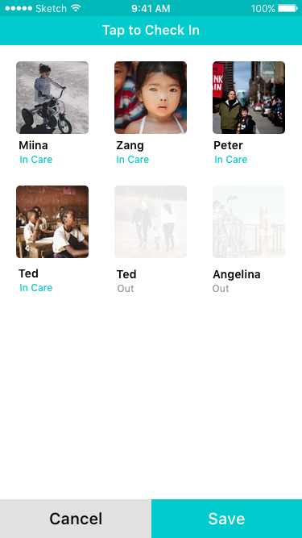
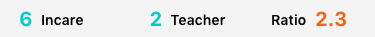
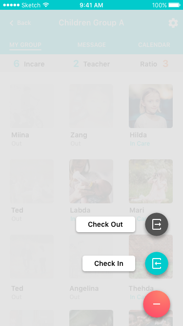
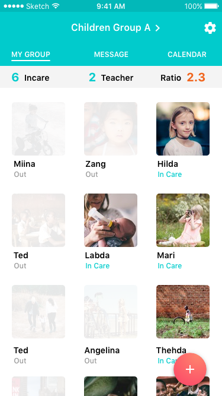

# Artboards

This is an autogenerated file showing all the artboards. Do not edit it directly.

## Check In Check Out - 1

## Check In Check Out - 2

## Check In Check Out - 3

## Class Status

## Fab 

## Fab Speed Dial

## Flow Name

## Icon 

## NavBar 

## Status 

## Status Bar

## Teacher Main Screen

