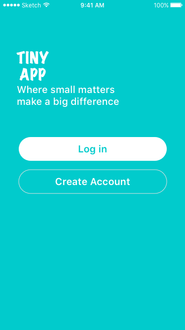

# Artboards

This is an autogenerated file showing all the artboards. Do not edit it directly.

## All Check in 1

## All Check in 2

## All Check in 3

## Black Page Title

## Button 

## Class Status 

## Fab 

## Fab Speed Dial

## Field 

## Flow Name

## Icon 

## Log Out

## Log in 

## Log in

## NavBar 

## Sign up 

## Single Check in 1

## Single Check in 2

## Single Check in 3

## Status 

## Status Bar

## Teacher 

## Welcome

